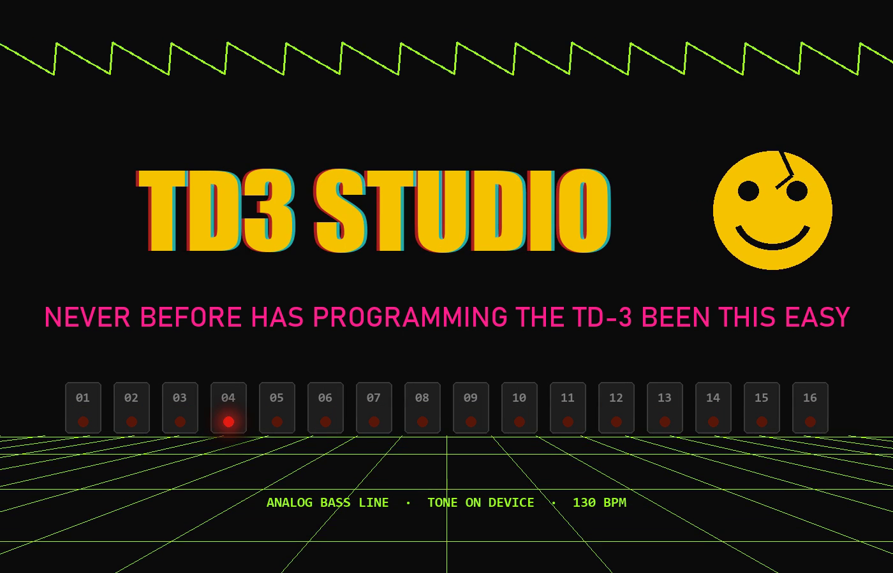
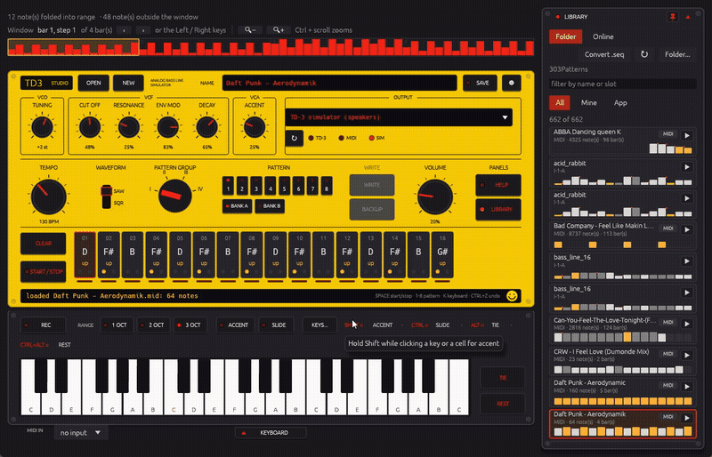
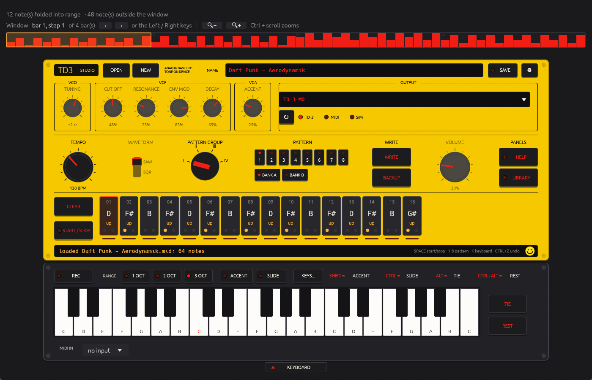
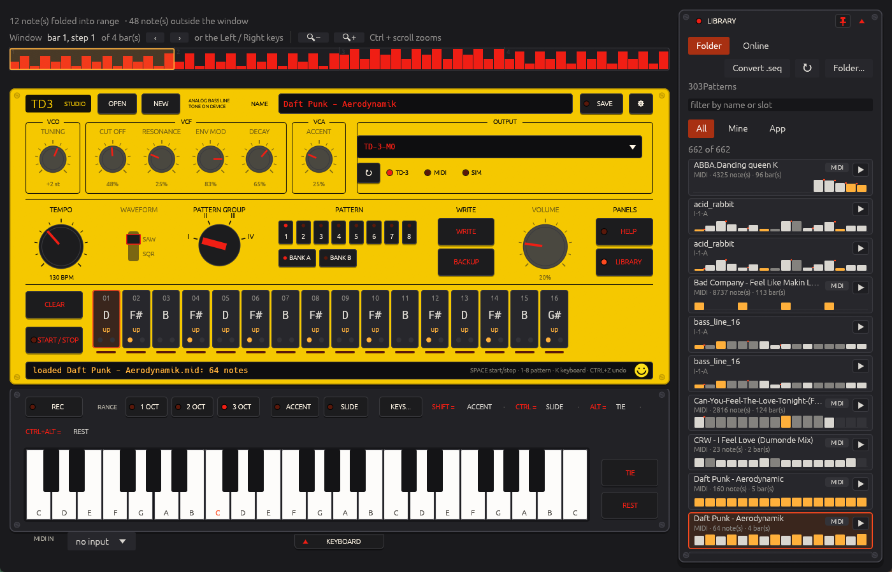

  

<h1 align="center">TD3 Studio</h1>

<b>Never before has programming the TD-3 been this easy.</b>

  <a href="#buying"><b>Buy TD3 Studio — €20, one-off</b></a> &nbsp;·&nbsp;
  <a href="https://github.com/johannusNL/TD3Studio/releases">Release notes</a> &nbsp;·&nbsp;
  <a href="https://www.instagram.com/td3studio">@td3studio</a>

  

Never before has programming the TD-3 been this easy. Drop a MIDI file on the instrument, slide the window over the bars you want, and the sixteen steps are cut for you — notes, octaves, accents, slides and ties. Hear it through the built-in 303 simulator, tweak it on the plate, and **WRITE** it straight into the TD-3 over USB.

## What it does

- **MIDI → pattern.** Any Standard MIDI file becomes a TD-3 pattern. A timeline above the plate shows the whole clip; drag the amber window, scroll it, step by bar, or zoom in with Ctrl + scroll to place the offset to the step. The root note follows the notes in the window.
- **The plate is the TD-3.** Sixteen step cells with note, octave, accent (amber) and slide (red). Click to select, scroll to move a semitone, modifier-click for accent / slide / tie / rest. Ctrl + Z undoes.
- **Play it in.** A three-octave keyboard under the plate, with 303-style step recording: press REC, and every key, TIE or REST fills the next step. Plug in a MIDI keyboard and play instead — velocity gives accents, legato gives slides.
- **Hear it.** OUTPUT goes to the TD-3's own USB port, another MIDI output, or the built-in simulator through your speakers — saw or square, resonant filter, envelope, accent and slides, driven by the tone knobs on the plate.
- **Write and back up.** PATTERN GROUP, pattern keys and BANK A/B pick the slot on the device; WRITE stores the pattern there, BACKUP fetches all 64 into a folder.
- **A library.** Your own folder of `.syx`, SynthTribe `.seq` / `.sqs` and `.mid` files, plus 107 bundled TB-303 lines by Acid-Tabs. Click a row to hear it, click again to open it. The Online tab searches free MIDI archives and downloads into your folder.
- **Help built in.** A short tour on first start, a help panel per part of the instrument, and every control explains itself when you hover over it.

  

## Requirements

- Windows 10 or 11 (64-bit).
- A Behringer **TD-3** or **TD-3-MO** connected over USB for WRITE, BACKUP and playing through the device. Without hardware everything works through the simulator.
- No account, no licence key, no subscription. Updates are included: TD3 Studio checks once a day and installs new versions with one click.

## Install

1. Open the download link in your purchase e-mail and save `TD3Studio-Setup-x.y.z.exe`.
2. Run it. It installs per user (no administrator password) into `%LOCALAPPDATA%\Programs\TD3 Studio` and adds a Start-menu entry.
3. Windows SmartScreen may show *"Windows protected your PC"* the first time, because the installer is not yet code-signed. Click **More info › Run anyway**.

## Buying

TD3 Studio is **€20, one-off**, including VAT, through Lemon Squeezy (iDEAL, cards, PayPal). The installer arrives by e-mail right after payment; every future version installs itself from inside the app. Questions and ideas: [Issues](https://github.com/johannusNL/TD3Studio/issues).

  

## Credits

Bundled patterns by [Acid-Tabs](https://acid-tabs.com), licensed CC BY-SA 4.0 (two in the Public Domain). TD-3 SysEx notes from [303patterns.com](https://303patterns.com/td3-midi.html). Online search via BitMidi, FreeMidi and MidiWorld.

Behringer and TD-3 are trademarks of Music Tribe. TD3 Studio is an independent product and is not affiliated with Music Tribe.

## Changelog

See [CHANGELOG.md](CHANGELOG.md) and the [releases](https://github.com/johannusNL/TD3Studio/releases).
