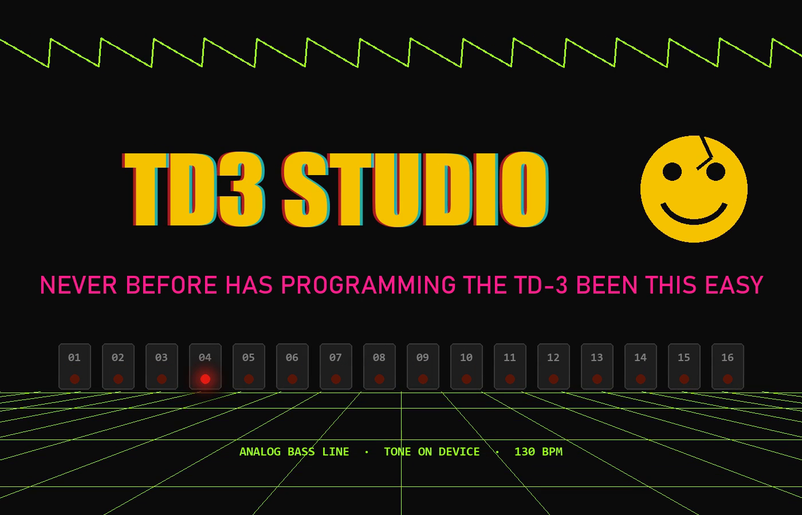
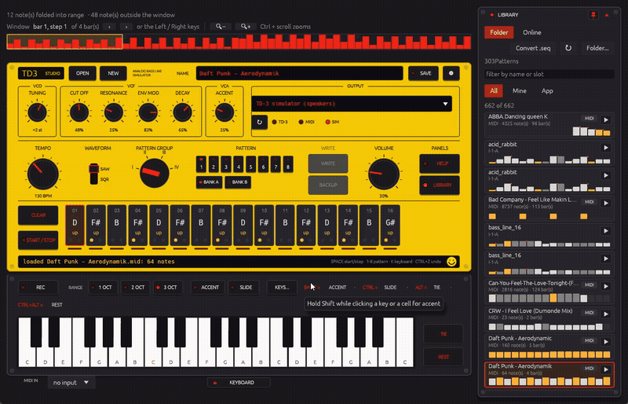
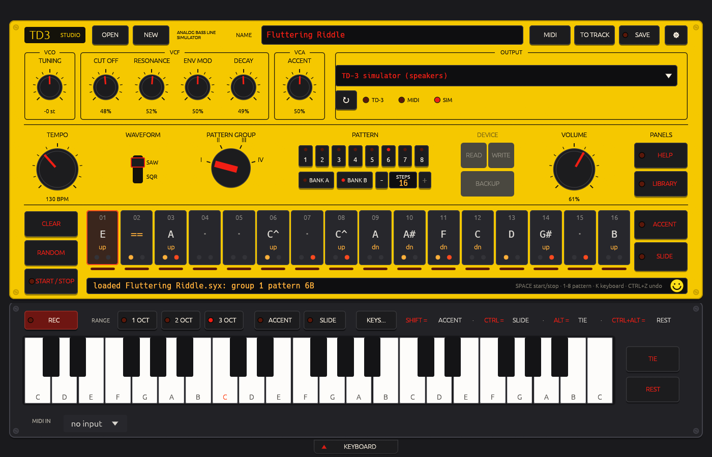
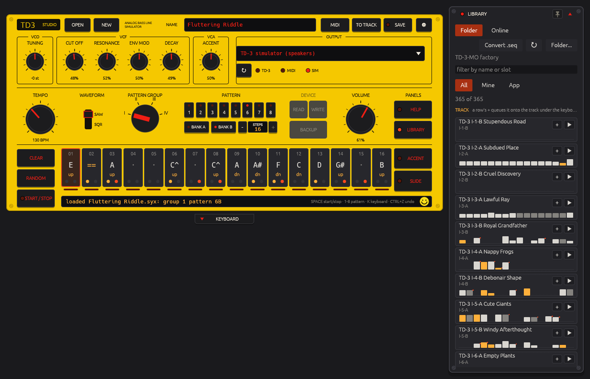

  

<h1 align="center">TD3 Studio</h1>

<b>Never before has programming the TD-3 been this easy.</b> · <a href="https://www.td3-studio.com">www.td3-studio.com</a>

  <a href="https://www.td3-studio.com/buy"><b>Buy TD3 Studio — €20, one-off</b></a> &nbsp;·&nbsp;
  <a href="https://apps.apple.com/app/td3-studio/id6811815519"><b>iPad &amp; iPhone on the App Store</b></a> &nbsp;·&nbsp;
  <a href="CHANGELOG.md">Release notes</a> &nbsp;·&nbsp;
  <a href="https://www.youtube.com/@td3studio">YouTube</a> &nbsp;·&nbsp;
  <a href="https://www.instagram.com/td3studio">@td3studio</a>

  

Never before has programming the TD-3 been this easy. Drop a MIDI file on the instrument, slide the window over the bars you want, and the sixteen steps are cut for you — notes, octaves, accents, slides and ties. Hear it through the built-in 303 simulator, tweak it on the plate, and **WRITE** it straight into the TD-3 over USB. On Windows, macOS and Linux, and on the iPad and iPhone.

## What it does

- **MIDI → pattern.** Any Standard MIDI file becomes a TD-3 pattern. A timeline above the plate shows the whole clip; drag the amber window, click a bar, step by bar, or zoom in with Ctrl + scroll to place the offset to the step. The root note follows the notes in the window.
- **The plate is the TD-3.** Sixteen step cells across the plate with note, octave, accent (amber) and slide (red), and ACCENT and SLIDE keys beside them. Click to select, scroll to move a semitone, modifier-click for accent / slide / tie / rest. STEPS sets the pattern length. Ctrl + Z undoes.
- **Play it in — or start from scratch.** NEW gives an empty plate, RANDOM rolls an acid line. A three-octave keyboard under it, with 303-style step recording: press REC, and every key, TIE or REST fills the next step. Plug in a MIDI keyboard and play instead — velocity gives accents, legato gives slides.
- **One modifier, everywhere.** Hold Shift for an accent or Ctrl for a slide (Cmd on a Mac) while you play a key or click a step; Alt ties, Ctrl+Alt rests. The same keys whether the note came from a file, the screen or your keyboard.
- **Hear it.** OUTPUT goes to the TD-3's own USB port, another MIDI output, or the built-in simulator through your speakers. The simulator is built on Open303 and measured against a TD-3-MO knob by knob — the diode-ladder filter, saw and square, accent and slides — driven by the tone knobs on the plate.
- **Write, read and back up.** PATTERN GROUP, pattern keys and BANK A/B pick the slot on the device; WRITE stores the pattern there, READ fetches a slot onto the plate, BACKUP fetches all 64 into a folder.
- **The track.** Queue patterns and they play back to back, handing over on the bar; *Write to...* stores the track as a run of slots on the device.
- **The TD-3's setup without SynthTribe.** MIDI channels, accent threshold, key priority, clock, transpose and pitch bend range over USB, plus the firmware version.
- **Into your DAW.** The MIDI key exports the pattern as a one-loop `.mid` file; the help explains MIDI and audio routing for Ableton Live. A separate DAW build for Windows follows an Ableton Link session.
- **A library.** Your own folder of `.syx`, SynthTribe `.seq` / `.sqs` and `.mid` files, plus 107 bundled TB-303 lines by Acid-Tabs. Click a row to hear it, click again to open it. The Online tab searches free MIDI archives and downloads into your folder.
- **Help built in.** A short tour on first start, a help panel per part of the instrument, and every control explains itself when you hover over it (or long-press it on a touch screen). English and Spanish.

  

## iPad and iPhone

The same instrument, made for touch, is on the [App Store](https://apps.apple.com/app/td3-studio/id6811815519): the whole plate in landscape on the iPad, and on the iPhone the same tools across three screens — PATTERN, SOUND and DEVICE. Patterns and MIDI files live in the Files app. The TD-3 connects through a USB cable that makes the iPad or iPhone the USB host (surest: Apple's USB-C to USB Adapter with the TD-3's own cable), or through a Bluetooth MIDI adapter such as a CME WIDI, paired from the OUTPUT menu. Sold and updated by Apple; a separate purchase from the desktop licence.

## Requirements

- Windows 10 or 11 (64-bit), macOS 11 or later (Apple silicon and Intel), or Linux x86_64 (Ubuntu 22.04 or newer, any distribution from 2022 on, as an AppImage).
- iPad or iPhone: iPadOS or iOS 17 or later.
- A Behringer **TD-3** or **TD-3-MO** connected over USB for WRITE, READ, BACKUP and playing through the device. Without hardware everything works through the simulator.
- No account, no licence key, no subscription. Updates are included: TD3 Studio checks once a day and installs new versions with one click. Under the setup key you choose the ring — the latest release, one version behind, or beta builds.

## Install

1. Open the download link in your purchase e-mail and save the installer for your platform.
2. **Windows:** run `TD3Studio-Setup-x.y.z.exe`. It installs per user (no administrator password) into `%LOCALAPPDATA%\Programs\TD3 Studio` and adds a Start-menu entry. SmartScreen may show *"Windows protected your PC"* the first time, because the installer is not yet code-signed: click **More info › Run anyway**.
3. **macOS:** open the disk image, drag TD3 Studio into Applications and start it once with **right-click › Open**.
4. **Linux:** make the AppImage executable and start it; the first start puts TD3 Studio in the app menu. MIDI goes through ALSA, so the TD-3 must show up in `aconnect -l`.

## Buying

TD3 Studio for the desktop is **€20, one-off** — no subscription, no licence key. Both Windows and macOS: **€35**.

**[Buy TD3 Studio → www.td3-studio.com/buy](https://www.td3-studio.com/buy)** (iDEAL, Apple Pay, Google Pay, cards). Choose your platform at checkout; the choice is final — a licence for the other platform costs €15 later with the same e-mail address.

The download link and invoice arrive by e-mail right after payment; every future version installs itself from inside the app. See the [installation guide](https://www.td3-studio.com/install) for the one-time Windows SmartScreen notice.

**iPad and iPhone:** €24.99 on the [App Store](https://apps.apple.com/app/td3-studio/id6811815519), one purchase for both.

Questions and ideas: *Report an issue or request a feature...* under the setup key in the app, td3-studio@50hz-services.nl, or [Issues](https://github.com/johannusNL/TD3Studio/issues).

  

## Credits

Bundled patterns by [Acid-Tabs](https://acid-tabs.com), licensed CC BY-SA 4.0 (two in the Public Domain). The simulator's voice builds on [Open303](https://github.com/RobinSchmidt/Open303) by Robin Schmidt (MIT). TD-3 SysEx notes from [303patterns.com](https://303patterns.com/td3-midi.html), with the pattern layout checked against a TD-3-MO. Online search via BitMidi, FreeMidi and MidiWorld.

Behringer and TD-3 are trademarks of Music Tribe. TD3 Studio is an independent product and is not affiliated with Music Tribe.

## Changelog

See [CHANGELOG.md](CHANGELOG.md).
